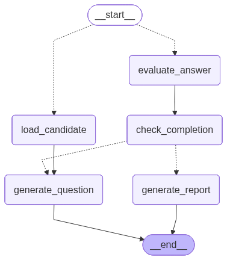

# AI Voice Interview Bot

## Overall Project Description
The AI Voice Interview Bot is an intelligent, voice-enabled technical interview system. It simulates a real technical interview by asking adaptive questions, listening to candidate audio responses, transcribing them, and dynamically evaluating the answers. 

The interview progresses through a structured cognitive framework based on **Bloom's Taxonomy** (Remember, Understand, Apply, Analyze, Evaluate). Once the interview is complete, the system generates a comprehensive evaluation report with a final score, strengths, weaknesses, and a hiring recommendation.

The backend is powered by **FastAPI** and **LangGraph** (for stateful agent workflows), with **SQLAlchemy** for database management. It integrates Speech-to-Text (STT) and Text-to-Speech (TTS) services to provide a seamless conversational experience.

## folder structure

```text
  interview bot/
│
├── agent/
│   ├── __init__.py
│   ├── graph.py
│   └── state.py
│
├── audio/                     # Generated TTS audio files
│
├── frontend/
│   ├── index.html
│   ├── interview.html
│   ├── report.html
│   └── scripts/
│       ├── api.js
│       ├── interview.js
│       ├── register.js
│       └── report.js
│
├── models/
│   ├── __init__.py
│   ├── candidate.py
│   ├── qa.py
│   ├── report.py
│   └── session.py
│
├── nodes/
│   ├── __init__.py
│   ├── load_candidate.py
│   ├── generate_question.py
│   ├── evaluvate_answer.py
│   ├── check_completion.py
│   └── generate_report.py
│
├── routes/
│   ├── __init__.py
│   ├── session_routes.py
│   ├── agent_routes.py
│   ├── audio_routes.py
│   └── report_routes.py
│
├── schemas/
│   ├── __init__.py
│   ├── candidate_schema.py
│   ├── interview_schema.py
│   ├── report_schema.py
│   └── session_schema.py
│
├── services/
│   ├── __init__.py
│   ├── llm_service.py
│   ├── evaluation_service.py
│   ├── stt_service.py
│   └── tts_service.py
│
├── tests/
│   ├── __init__.py
│   ├── conftest.py
│   └── test_routes.py
│
├── uploads/                   # Uploaded recorded answers
│
├── utils/
│   ├── __init__.py
│   ├── helpers.py
│   ├── parser.py
│   └── prompts.py
│
├── .env
├── .gitignore
├── database.py
├── init_db.py
├── interview.db
├── main.py
├── pyproject.toml
├── README.md
└── uv.lock
```

## Graph Flow (LangGraph)
The interview logic is orchestrated using a state graph (`LangGraph`), ensuring robust state management across the session:

1. **`load_candidate`**: Fetches the candidate's profile, skills, and experience from the database.
2. **`generate_question`**: Uses the LLM to generate the next question calibrated to the current Bloom's taxonomy level.
3. **`evaluate_answer`**: Evaluates the transcribed answer using a strict rubric and immediately saves the score and feedback to the database.
4. **`check_completion`**: Verifies if the required number of questions (default: 5) have been evaluated. 
   - *If incomplete*: Routes back to `generate_question`.
   - *If complete*: Routes to `generate_report`.
5. **`generate_report`**: Compiles all Q&A pairs into a final summary report with a hire recommendation.

## Langgraph Graph Image



## API Endpoints
The backend exposes **6 primary API endpoints**:
- `POST /session/register`: Registers a new candidate and initializes an interview session.
- `POST /agent/respond`: The core LangGraph interaction loop (processes answer, returns next question or completion signal).
- `POST /stt` (Audio): Converts candidate voice recordings to text via Speech-to-Text.
- `POST /tts` (Audio): Converts agent questions into audio streams via Text-to-Speech.
- `GET /report/{session_id}`: Retrieves the final interview report.
- `GET /health`: System health, path, and configuration check.

## Database Tables
The system utilizes **4 database tables** to persist data reliably:
1. **`candidates`**: Stores candidate profiles (name, role, skills, experience).
2. **`sessions`**: Tracks active and completed interview sessions.
3. **`questions_answers`**: Stores every generated question, the candidate's transcribed answer, and the LLM's evaluation score/feedback.
4. **`reports`**: Stores the final aggregated assessment, including overall score, strengths, and weaknesses.

## Flow Diagram


## User Interface

